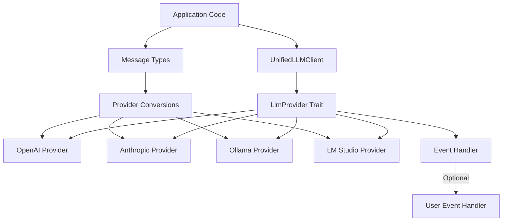
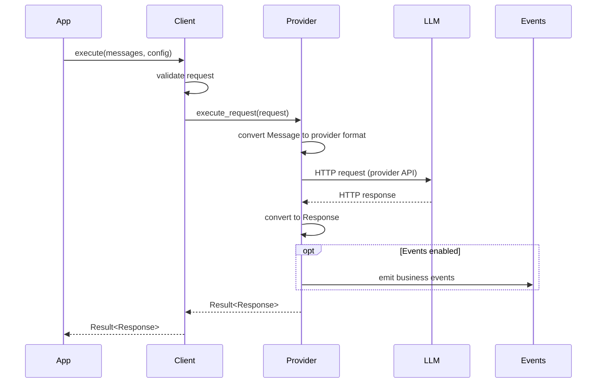

# multi-llm: Design Document

> **Version**: 1.0
> **Status**: Living Document
> **Last Updated**: 2025-11-25

## Table of Contents

1. [Overview & Philosophy](#1-overview--philosophy)
2. [Design Goals & Non-Goals](#2-design-goals--non-goals)
3. [Architecture Overview](#3-architecture-overview)
4. [Core Abstractions](#4-core-abstractions)
5. [Provider Integration Model](#5-provider-integration-model)
6. [Public API Design](#6-public-api-design)
7. [Error Handling Strategy](#7-error-handling-strategy)
8. [Events System](#8-events-system)
9. [Testing Strategy](#9-testing-strategy)
10. [Stability & Versioning](#10-stability--versioning)
11. [Future Directions](#11-future-directions)
12. [Appendices](#appendices)

---

## 1. Overview & Philosophy

### Purpose

The `multi-llm` library provides a unified, type-safe interface for interacting with multiple Large Language Model (LLM) providers through a single abstraction. It eliminates the need to learn and maintain separate client libraries for each LLM provider by offering:

- **Unified message format** that works across OpenAI, Anthropic, Ollama, and LM Studio
- **Multi-provider support** with concurrent connections to N providers (1 to many, configured via config)
- **Provider-agnostic API** with consistent error handling and response types
- **Native support** for advanced features like prompt caching and tool calling
- **Type safety** leveraging Rust's type system to prevent runtime errors

Applications can configure one provider for simple use cases, or multiple providers for redundancy, A/B testing, or provider-specific feature access - all through configuration without code changes.

**Multi-Instance Pattern**: The library supports multiple instances of the same provider type, even with identical configurations. This enables:
- **Different models**: Fast vs powerful models from the same provider
- **Different configurations**: Varied caching, temperature, or other parameters
- **Business tracking**: Identical configs with different labels to track usage patterns via events
- **A/B testing**: Compare identical setups with different API keys or labels
- **Complete flexibility**: Library users decide how and why to instantiate multiple providers

### Design Philosophy

1. **KISS Principle (Keep It Simple, Stupid)**: Favor simplicity over complexity. Simple solutions are maintainable solutions. Complexity is a cost that must be justified.
2. **Unified Abstraction**: Single message format across all providers - write once, run anywhere
3. **Multi-Provider by Design**: Support 1 to N concurrent provider connections configured via config, not code
4. **Provider Transparency**: Don't hide provider differences; expose them clearly through configuration
5. **Library-First**: Pure library with no application assumptions or business logic
6. **Minimal Dependencies**: Every dependency impacts downstream users - be selective
7. **Async-First**: Modern Rust async/await patterns throughout
8. **Error Transparency**: Rich error types expose provider-specific failures for informed handling
9. **Type Safety**: Leverage Rust's type system to catch errors at compile time

### Scope Boundaries

**In Scope**:
- Unified message format for LLM communication
- Multi-provider support (OpenAI, Anthropic, Ollama, LM Studio)
- Tool/function calling abstraction
- Prompt caching hints (Anthropic-style, extensible to other providers)
- Provider configuration management
- Async API for all I/O operations
- Rich error types with retry information
- Optional business event logging (feature-gated)

**Out of Scope**:
- Application-level concerns (sessions, user management, authentication beyond API keys)
- Business logic or domain-specific workflows
- Built-in rate limiting or quota management (users implement via tower middleware)
- Prompt engineering utilities or templates
- Vector databases or embeddings
- Model training or fine-tuning

---

## 2. Design Goals & Non-Goals

### Primary Goals

1. **Provider Agnostic**: Write application code once, switch providers with configuration change
2. **Type Safety**: Leverage Rust's type system to prevent errors at compile time
3. **Flexibility**: Support provider-specific features without compromising core abstraction
4. **Maintainability**: Simple, consistent patterns across all provider implementations
5. **Library-Grade Quality**: Pure library suitable for use as a dependency in any Rust project

### Explicit Non-Goals

1. **Universal API Coverage**: Not trying to support every feature of every LLM provider
2. **Feature Parity Enforcement**: Providers have different capabilities; we expose differences, not hide them
3. **Application Framework**: Not an opinionated framework, just a library
4. **Streaming (pre-1.0)**: Streaming support deferred to post-1.0 due to complexity
5. **Synchronous API**: Async-only by design; no blocking APIs

### Success Criteria

- **Developer Experience**: Switching from OpenAI to Anthropic requires only config change, not code rewrite
- **Type Safety**: Common mistakes (wrong message format, missing required config) caught at compile time
- **Performance**: Zero-copy conversions where possible, minimal allocation overhead
- **Stability**: Public API stable after 1.0, internal implementations can evolve

---

## 3. Architecture Overview

### System Architecture



### Data Flow



### Module Organization

```
multi-llm/
├── src/
│   ├── lib.rs               # Public API re-exports (MINIMAL)
│   ├── messages.rs          # Message, MessageRole, MessageContent (PUBLIC)
│   ├── provider.rs          # LlmProvider trait (PUBLIC)
│   ├── response.rs          # Response types (PUBLIC)
│   ├── error.rs             # LlmError (PUBLIC)
│   ├── config.rs            # Provider configs (PUBLIC)
│   ├── providers/           # Provider implementations (INTERNAL)
│   │   ├── anthropic/       # Anthropic Claude
│   │   ├── openai/          # OpenAI GPT
│   │   ├── ollama/          # Ollama
│   │   └── lmstudio/        # LM Studio
│   └── internals/           # Internal utilities (NOT exported)
│       ├── retry.rs         # Retry logic
│       ├── tokens.rs        # Token counting
│       ├── response_parser.rs
│       └── events.rs        # Event types (feature-gated)
```

**Design Principle**: Clear separation between public API (stable, documented) and internal implementation (can change freely).

---

## 4. Core Abstractions

### 4.1 Message Types

**Purpose**: Provider-agnostic message format supporting all common LLM message patterns.

**Key Decision**: Single unified format vs per-provider types
- **Chosen**: Unified format with provider-specific attributes
- **Rationale**: Enables provider switching without code changes; complexity hidden in conversion layer
- **Trade-off**: Some provider features require "escape hatch" metadata attributes

**Core Types**:

```rust
pub enum MessageRole {
    System,
    User,
    Assistant,
    Tool,
}

pub enum MessageContent {
    Text(String),
    ToolCall(ToolCallContent),
    ToolResult(ToolResultContent),
}

pub struct MessageAttributes {
    pub cache_control: Option<CacheControl>,  // Anthropic prompt caching
    pub priority: i32,                        // Message ordering hint
    pub metadata: HashMap<String, Value>,     // Provider-specific extras
}

pub struct Message {
    pub role: MessageRole,
    pub content: MessageContent,
    pub attributes: MessageAttributes,
}
```

**Builder Pattern** (for ergonomics):
```rust
let msg = Message::user("What is the capital of France?")
    .cacheable()
    .with_priority(10)
    .build();
```

**See**: [ADR-001: Unified Message Architecture](./adr/001-unified-message-architecture.md)

### 4.2 LlmProvider Trait

**Purpose**: Define contract that all provider implementations must satisfy.

**Current State** (legacy naming to be removed):
```rust
#[async_trait]
pub trait ExecutorLLMProvider: Send + Sync {
    async fn execute_llm(
        &self,
        request: Request,
        config: Option<RequestConfig>,
    ) -> Result<Response, LlmError>;

    fn provider_name(&self) -> &'static str;
}
```

**Target State** (post-cleanup):
```rust
#[async_trait]
pub trait LlmProvider: Send + Sync {
    async fn execute(
        &self,
        request: Request,
        config: Option<RequestConfig>,
    ) -> Result<Response, LlmError>;

    fn provider_name(&self) -> &'static str;

    // Optional: Provider-specific capabilities
    fn supports_streaming(&self) -> bool { false }
    fn supports_caching(&self) -> bool { false }
}
```

**Design Principles**:
- **Async-only**: All providers are async (no blocking APIs)
- **Send + Sync**: Enable multi-threaded runtime usage
- **Result-based**: No panics; all errors returned as `Result`
- **Unified request/response**: Providers convert to/from their native formats internally

**See**: [ADR-002: Provider Trait Design](./adr/002-provider-trait-design.md)

### 4.3 Tool Calling

**Purpose**: Unified abstraction for function/tool calling across providers.

```rust
pub struct Tool {
    pub name: String,
    pub description: String,
    pub parameters: Value,  // JSON Schema
}

pub enum ToolChoice {
    Auto,      // Let LLM decide
    None,      // Don't use tools
    Required,  // Must use a tool
    Specific(String),  // Use specific tool
}

pub struct ToolCall {
    pub id: String,
    pub name: String,
    pub arguments: Value,
}

pub struct ToolResult {
    pub tool_call_id: String,
    pub content: String,
    pub is_error: bool,
}
```

**Validation**: Tools validated at config construction time:
- Unique tool names
- Valid JSON Schema in parameters
- Required fields present

### 4.4 Caching Hints

**Purpose**: Support Anthropic-style prompt caching without coupling to Anthropic.

**Design**:
```rust
pub struct CacheControl {
    pub cache_type: CacheType,
}

pub enum CacheType {
    Ephemeral,   // Anthropic: 5-minute cache
    Extended,    // Anthropic: 1-hour cache
    // Future: Persistent, Custom(Duration), etc.
}

// Attached to MessageAttributes
message.attributes.cache_control = Some(CacheControl::ephemeral());
message.attributes.cache_control = Some(CacheControl::extended());
```

**Rationale**:
- Anthropic has native caching with two tiers (5-minute ephemeral, 1-hour extended)
- Both cache types are exposed from the start (extended cache used in production)
- Implemented as optional attributes (ignored by providers that don't support it)
- Future-proof: new providers can adopt if they support caching

**See**: [ADR-003: Caching Hints Architecture](./adr/003-caching-hints.md)

### 4.5 Request and Response Types

**Request**:
```rust
pub struct Request {
    pub messages: Vec<Message>,
    pub config: Option<RequestConfig>,
}

pub struct RequestConfig {
    pub temperature: Option<f64>,
    pub max_tokens: Option<u32>,
    pub tools: Vec<Tool>,
    pub tool_choice: Option<ToolChoice>,
    pub response_format: Option<ResponseFormat>,
    // Provider-specific overrides in metadata
    pub metadata: HashMap<String, Value>,
}
```

**Response**:
```rust
pub struct Response {
    pub content: String,
    pub role: MessageRole,
    pub tool_calls: Vec<ToolCall>,
    pub usage: TokenUsage,
    pub finish_reason: FinishReason,
    #[cfg(feature = "events")]
    pub events: Vec<BusinessEvent>,
}

pub struct TokenUsage {
    pub prompt_tokens: u32,
    pub completion_tokens: u32,
    pub total_tokens: u32,
    // Anthropic caching stats
    pub cache_creation_tokens: Option<u32>,
    pub cache_read_tokens: Option<u32>,
}
```

---

## 5. Provider Integration Model

### Adding a New Provider

**Steps**:
1. Create module in `src/providers/new_provider/`
2. Define provider-specific types (request/response formats)
3. Implement conversion: `Message` → provider format
4. Implement conversion: provider response → `Response`
5. Implement `LlmProvider` trait
6. Add configuration in `src/config.rs`
7. Add tests (unit tests for conversions, integration tests for end-to-end)

### Example Pattern

```rust
// src/providers/openai/mod.rs

pub struct OpenAIProvider {
    config: OpenAIConfig,
    client: reqwest::Client,
}

impl OpenAIProvider {
    pub fn new(config: OpenAIConfig) -> Result<Self, LlmError> {
        let client = reqwest::Client::builder()
            .timeout(Duration::from_secs(120))
            .build()?;
        Ok(Self { config, client })
    }
}

#[async_trait]
impl LlmProvider for OpenAIProvider {
    async fn execute(
        &self,
        request: Request,
        config: Option<RequestConfig>,
    ) -> Result<Response, LlmError> {
        // 1. Convert unified types to OpenAI format
        let openai_request = convert_request(&request, config)?;

        // 2. Make HTTP request
        let response = self.client
            .post(&self.config.endpoint)
            .header("Authorization", format!("Bearer {}", self.config.api_key))
            .json(&openai_request)
            .send()
            .await
            .map_err(LlmError::network_error)?;

        // 3. Parse response
        let openai_response = response.json::<OpenAIResponse>()
            .await
            .map_err(LlmError::response_parse_error)?;

        // 4. Convert to unified Response
        convert_response(openai_response)
    }

    fn provider_name(&self) -> &'static str {
        "openai"
    }
}
```

### Consistency Requirements

All providers must follow these patterns:

1. **Configuration**: Each provider has dedicated config struct implementing `ProviderConfig` trait
2. **Error Mapping**: All provider-specific errors mapped to `LlmError` variants
3. **Logging**: Use `log_debug!`, `log_info!`, `log_warn!`, `log_error!` macros at appropriate levels
   - These macros abstract the underlying logging implementation (currently `tracing`)
   - Allows future logging framework changes without code rewrites
4. **Testing**:
   - Unit tests for message conversions
   - Unit tests for error handling
   - Integration tests for full request/response cycle (can be `#[ignore]` if requires external service)
5. **No Panics**: Return `Result` everywhere; never `unwrap()`, `expect()`, or `unreachable!()`
6. **No println!**: Use internal `log_*!` macros (available via `crate::logging`)

### Provider-Specific Features

**Handling features unique to one provider**:

1. **Configuration**: Expose via provider-specific config struct (preferred)
   ```rust
   pub struct AnthropicConfig {
       pub api_key: String,
       pub cache_ttl: Option<String>,  // Anthropic-specific
   }
   ```

2. **Metadata escape hatch**: Use `RequestConfig.metadata` for provider-specific overrides
   ```rust
   let mut config = RequestConfig::default();
   config.metadata.insert("anthropic:cache_ttl".into(), json!("5m"));
   ```

   **Important**: Metadata is a **workaround** to prevent blocking users who need provider-specific features not yet in the library. If you find yourself using metadata:
   - **File an issue** requesting the feature be added to the library properly
   - **Submit a PR** implementing the feature in a provider-agnostic way
   - Metadata should be temporary - we want to reduce its usage over time by properly supporting features

3. **Response data**: Include optional fields that only some providers populate
   ```rust
   pub struct TokenUsage {
       // Universal
       pub total_tokens: u32,
       // Anthropic-specific (None for other providers)
       pub cache_read_tokens: Option<u32>,
   }
   ```

---

## 6. Public API Design

### Stability Tiers

| Tier | Stability | Examples | Breaking Changes |
|------|-----------|----------|------------------|
| **Public API** | Locked after 1.0 | `LlmProvider` trait, `UnifiedMessage`, `Response`, `LlmError` | Requires major version bump |
| **Public Config** | Stable | Provider config structs, `RequestConfig` | Minor version if additive only |
| **Internal** | Unstable | Provider implementations, conversions, retry logic | Can change freely in any version |

### Minimal Public API Surface

**Philosophy**: Only expose what users need directly. Keep internals private.

**Public exports from `lib.rs`** (~28 types):

```rust
// Client
pub use client::UnifiedLLMClient;

// Core message types
pub use core_types::{
    UnifiedMessage, MessageRole, MessageContent, MessageAttributes, MessageCategory,
};

// Request/Response types
pub use core_types::{
    UnifiedLLMRequest, RequestConfig, Response, TokenUsage,
};

// Tool types
pub use core_types::{
    Tool, ToolCall, ToolChoice, ToolResult, ResponseFormat,
};

// Provider trait
pub use core_types::LlmProvider;

// Error types
pub use error::{LlmError, LlmResult};

// Provider configs (for construction)
pub use config::{
    LLMConfig, OpenAIConfig, AnthropicConfig, OllamaConfig, LMStudioConfig,
    DefaultLLMParams, DualLLMConfig, LLMPath, ProviderConfig,
};

// Provider implementations (for construction only)
pub use providers::{
    OpenAIProvider, AnthropicProvider, OllamaProvider, LMStudioProvider,
};

// Token counting
pub use tokens::{
    TokenCounter, TokenCounterFactory, AnthropicTokenCounter, OpenAITokenCounter,
};

// Retry configuration
pub use retry::RetryPolicy;

// Events (feature-gated)
#[cfg(feature = "events")]
pub use core_types::{BusinessEvent, EventScope, LLMBusinessEvent, event_types};
```

**NOT exported** (internal implementation details):
- `logging` module - internal tracing macros
- `response_parser` module - internal parsing logic
- `retry` internals - `CircuitBreaker`, `CircuitState`, `RetryExecutor`
- Error classification - `ErrorCategory`, `ErrorSeverity`, `UserErrorCategory`
- Internal types - `ToolCallingRound`
- Provider conversion modules
- HTTP client utilities

### API Usage Examples

**Basic usage**:
```rust
use multi_llm::{Message, Request, OpenAIProvider, OpenAIConfig};

#[tokio::main]
async fn main() -> Result<(), Box<dyn std::error::Error>> {
    let config = OpenAIConfig {
        api_key: std::env::var("OPENAI_API_KEY")?,
        ..Default::default()
    };

    let provider = OpenAIProvider::new(config)?;

    let request = Request {
        messages: vec![
            Message::user("What is the capital of France?"),
        ],
        config: None,
    };

    let response = provider.execute(request, None).await?;
    println!("Response: {}", response.content);

    Ok(())
}
```

**Provider switching**:
```rust
use multi_llm::{LlmProvider, AnthropicProvider, OpenAIProvider};

// Common interface
async fn ask_llm(
    provider: &dyn LlmProvider,
    question: &str
) -> Result<String, LlmError> {
    let request = Request {
        messages: vec![Message::user(question)],
        config: None,
    };

    let response = provider.execute(request, None).await?;
    Ok(response.content)
}

// Works with any provider
let openai = OpenAIProvider::new(openai_config)?;
let anthropic = AnthropicProvider::new(anthropic_config)?;

let answer1 = ask_llm(&openai, "What is 2+2?").await?;
let answer2 = ask_llm(&anthropic, "What is 2+2?").await?;
```

**Tool calling**:
```rust
use multi_llm::{Tool, ToolChoice, RequestConfig};

let tools = vec![
    Tool {
        name: "get_weather".to_string(),
        description: "Get current weather for a location".to_string(),
        parameters: json!({
            "type": "object",
            "properties": {
                "location": {"type": "string"}
            },
            "required": ["location"]
        }),
    },
];

let config = RequestConfig {
    tools,
    tool_choice: Some(ToolChoice::Auto),
    ..Default::default()
};

let response = provider.execute(request, Some(config)).await?;

if !response.tool_calls.is_empty() {
    for tool_call in response.tool_calls {
        println!("Tool called: {}", tool_call.name);
        println!("Arguments: {}", tool_call.arguments);
    }
}
```

---

## 7. Error Handling Strategy

### Design Principles

1. **No Panics**: Library code never panics; all errors returned as `Result`
2. **Rich Context**: Errors include provider info, HTTP status, error messages, retry hints
3. **Provider Transparency**: Expose provider-specific errors clearly
4. **Actionable**: Users can distinguish retryable vs non-retryable errors

### Error Hierarchy

**Current** (legacy naming):
```rust
pub enum LlmError {
    ConfigurationError(String),
    NetworkError(reqwest::Error),
    ProviderError { provider: String, status_code: Option<u16>, message: String },
    ValidationError(String),
    ConversionError(String),
}
```

**Target** (after cleanup):
```rust
#[derive(Debug, thiserror::Error)]
pub enum LlmError {
    #[error("Configuration error: {0}")]
    Configuration(String),

    #[error("Network error: {0}")]
    Network(#[from] reqwest::Error),

    #[error("Provider {provider} error (status {status_code:?}): {message}")]
    Provider {
        provider: String,
        status_code: Option<u16>,
        message: String,
        retry_after: Option<Duration>,
    },

    #[error("Validation error: {0}")]
    Validation(String),

    #[error("Response parse error: {0}")]
    ResponseParse(String),

    #[error("Rate limit exceeded (retry after {retry_after:?})")]
    RateLimit {
        retry_after: Option<Duration>,
    },

    #[error("Authentication failed: {0}")]
    Authentication(String),
}

impl LlmError {
    pub fn is_retryable(&self) -> bool {
        matches!(self,
            LlmError::Network(_) |
            LlmError::RateLimit { .. } |
            LlmError::Provider { status_code: Some(500..=599), .. }
        )
    }

    pub fn retry_after(&self) -> Option<Duration> {
        match self {
            LlmError::Provider { retry_after, .. } => *retry_after,
            LlmError::RateLimit { retry_after } => *retry_after,
            _ => None,
        }
    }
}
```

### Error Mapping from Providers

Each provider maps its errors to `LlmError`:

```rust
// OpenAI 429 rate limit
LlmError::RateLimit {
    retry_after: parse_retry_after_header(response),
}

// Anthropic 401 auth error
LlmError::Authentication(
    "Invalid API key".to_string()
)

// Generic 500 server error
LlmError::Provider {
    provider: "openai",
    status_code: Some(500),
    message: "Internal server error",
    retry_after: None,
}
```

**See**: [ADR-004: Error Handling Strategy](./adr/004-error-handling.md)

---

## 8. Events System

### Purpose

The events system provides **optional** observability into LLM operations for applications that need structured event logging (caching hits, token usage, provider selection, etc.).

### Design Decision

**Status**: Feature-gated (enabled via `features = ["events"]`)

**Rationale**:
- Many applications need observability beyond basic logging
- Business events capture structured data (tokens, cache hits, costs)
- Must remain **optional** - not all library users want/need events
- Enables downstream analytics, cost tracking, performance monitoring

### Architecture

**When feature is enabled**:
```rust
#[cfg(feature = "events")]
pub struct BusinessEvent {
    pub event_id: String,
    pub timestamp: DateTime<Utc>,
    pub event_type: EventType,
    pub scope: EventScope,
    pub metadata: HashMap<String, Value>,
}

#[cfg(feature = "events")]
pub enum EventType {
    CacheHit { tokens_saved: u32 },
    CacheWrite { tokens_written: u32 },
    TokenUsage { prompt: u32, completion: u32 },
    ProviderCall { provider: String, duration_ms: u64 },
    // ... extensible
}

#[cfg(feature = "events")]
pub enum EventScope {
    Request(String),     // Per-request ID
    Session(String),     // Per-session ID (if app provides)
    User(String),        // Per-user ID (if app provides)
}
```

**When feature is disabled**:
- Event types not compiled
- No runtime overhead
- Response struct doesn't include events field

### Usage Pattern

**Provider implementation**:
```rust
#[async_trait]
impl LlmProvider for AnthropicProvider {
    async fn execute(...) -> Result<Response, LlmError> {
        // ... make request ...

        let mut response = Response {
            content: anthropic_response.content,
            // ... other fields ...
            #[cfg(feature = "events")]
            events: Vec::new(),
        };

        #[cfg(feature = "events")]
        {
            if let Some(cache_stats) = anthropic_response.usage.cache_read_input_tokens {
                response.events.push(BusinessEvent::cache_hit(cache_stats));
            }
        }

        Ok(response)
    }
}
```

**Application usage**:
```rust
#[cfg(feature = "events")]
{
    for event in response.events {
        match event.event_type {
            EventType::CacheHit { tokens_saved } => {
                log_cost_savings(tokens_saved);
            }
            EventType::TokenUsage { prompt, completion } => {
                track_usage(prompt, completion);
            }
            _ => {}
        }
    }
}
```

### Why Feature-Gated?

1. **Dependency minimization**: Events require `uuid` and `chrono` - users without events don't pay this cost
2. **Performance**: No event allocation/collection overhead when disabled
3. **Simplicity**: Users who just want basic LLM calls don't see event machinery
4. **Library principle**: Optional features should be opt-in, not forced

**See**: [ADR-005: Events System Design](./adr/005-events-system.md)

---

## 9. Testing Strategy

### Test Organization

**Unit Tests** (`src/*/tests.rs` or `#[cfg(test)]` modules):
- **Purpose**: Test individual functions/methods in isolation
- **Focus**: Message conversions, validation logic, error mapping
- **Speed**: Fast (no network, no external dependencies)
- **Run**: `cargo test --lib`

**Integration Tests** (`tests/` directory):
- **Purpose**: Test public APIs, full request/response cycles
- **Focus**: Provider switching, error propagation, end-to-end flows
- **Speed**: Slower (some require external services)
- **Run**: `cargo test --tests`
- **Note**: Tests requiring external services marked `#[ignore]`

### Test Principles

1. **Independence**: Tests don't share state, can run in any order
2. **Clarity**: Descriptive names following pattern `test_<what>_<condition>_<expected>`
3. **AAA Pattern**: Arrange, Act, Assert
4. **Fast by Default**: Slow tests marked `#[ignore]`, run separately
5. **Realistic**: Test actual usage patterns, not implementation details

### Example Tests

**Unit test (conversion)**:
```rust
#[cfg(test)]
mod tests {
    use super::*;

    #[test]
    fn test_message_to_openai_conversion_user_text() {
        // Arrange
        let message = Message::user("Hello world");

        // Act
        let openai_msg = convert_to_openai_message(&message).unwrap();

        // Assert
        assert_eq!(openai_msg.role, "user");
        assert_eq!(openai_msg.content, "Hello world");
    }

    #[test]
    fn test_tool_validation_rejects_duplicate_names() {
        // Arrange
        let config = RequestConfig {
            tools: vec![
                Tool { name: "get_weather".into(), /* ... */ },
                Tool { name: "get_weather".into(), /* ... */ },
            ],
            ..Default::default()
        };

        // Act
        let result = config.validate();

        // Assert
        assert!(result.is_err());
        assert!(matches!(result.unwrap_err(), LlmError::Validation(_)));
    }
}
```

**Integration test**:
```rust
#[tokio::test]
#[ignore] // Requires OpenAI API key
async fn test_openai_provider_basic_request() {
    let config = OpenAIConfig {
        api_key: std::env::var("OPENAI_API_KEY").unwrap(),
        ..Default::default()
    };

    let provider = OpenAIProvider::new(config).unwrap();

    let request = Request {
        messages: vec![Message::user("Say 'test'")],
        config: None,
    };

    let response = provider.execute(request, None).await.unwrap();

    assert!(!response.content.is_empty());
    assert_eq!(response.role, MessageRole::Assistant);
}
```

### Testing Guidelines

- **Don't mock provider implementations** - test them against real APIs (ignored tests)
- **Do mock external dependencies** in unit tests (use `mockall` for traits)
- **Test error paths** - verify errors are mapped correctly
- **Test provider-specific features** - caching, tool calling, etc.
- **Test provider switching** - same code works with different providers

---

## 10. Stability & Versioning

### Semantic Versioning

Following [SemVer 2.0](https://semver.org/):

**Major (X.0.0)** - Breaking changes to public API:
- Changing `Message` structure
- Removing/renaming public methods
- Changing trait signatures
- Removing public types

**Minor (0.X.0)** - Additive changes:
- New providers
- New optional fields on existing types (with defaults)
- New public methods
- New traits (not affecting existing code)

**Patch (0.0.X)** - Bug fixes and internal changes:
- Provider conversion fixes
- Performance improvements
- Documentation updates
- Internal refactoring

### Stability Guarantees

**Pre-1.0 (Current)**:
- Public API can change with minor version bumps
- Breaking changes documented in CHANGELOG
- Goal: Stabilize API based on real-world usage feedback

**Post-1.0**:
- **Public API locked**: Breaking changes require 2.0
- **Internal implementations free**: Can evolve without version bump
- **Provider additions**: Minor version bumps
- **New features**: Minor version if additive, major if breaking

### API Evolution Strategy

**Before 1.0** (cleanup phase):
1. Remove legacy naming (`Executor*` → simpler names)
2. Remove parent project references (`MyStoryError` → `LlmError`)
3. Narrow public API surface (hide internals)
4. Feature-gate events system
5. Stabilize core types (`Message`, `Response`, `LlmError`)

**After 1.0**:
- Public types frozen (only additive changes)
- New features via new types/traits (not breaking existing)
- Deprecation warnings before removal (one major version notice)

### Deprecation Policy

**Post-1.0**:
1. Mark deprecated in version N.x.0 with `#[deprecated]` attribute
2. Document replacement in deprecation message
3. Keep deprecated items for one major version
4. Remove in version (N+1).0.0

```rust
#[deprecated(since = "1.5.0", note = "Use `execute` instead")]
pub async fn execute_llm(...) -> Result<Response, LlmError> {
    self.execute(...).await
}
```

---

## 11. Future Directions

### Post-1.0 Planned Features

#### Streaming Support
**Status**: Deferred to post-1.0 (complex, needs careful design)

**Rationale for deferral**:
- Streaming adds significant API surface (new trait methods, stream types)
- Error handling in streams is complex (partial responses, cancellation)
- Backpressure and buffering strategies need careful design
- Want to stabilize core request/response API first

**Future design considerations**:
```rust
#[async_trait]
pub trait LlmProvider {
    // Existing
    async fn execute(...) -> Result<Response, LlmError>;

    // Future: streaming variant
    async fn execute_stream(...)
        -> Result<impl Stream<Item = Result<StreamChunk>>, LlmError>;
}

pub enum StreamChunk {
    ContentDelta(String),
    ToolCallStart { id: String, name: String },
    ToolCallDelta(String),
    ToolCallEnd,
    Done(TokenUsage),
}
```

#### Additional Providers
- Google Gemini
- Cohere
- Mistral
- Groq
- Custom provider trait for user-defined providers

#### Enhanced Features
1. **Retry Policies**: Configurable retry with exponential backoff (currently internal)
2. **Circuit Breaker**: Automatic failover on provider degradation
3. **Token Estimation**: Pre-flight token counting across providers
4. **Response Caching**: Local caching of LLM responses (user-configurable)
5. **Batch Requests**: Send multiple requests in parallel with result aggregation

### Under Consideration

- **Telemetry**: Optional OpenTelemetry integration for distributed tracing
- **Provider Health Checks**: Automatic provider availability detection
- **Cost Tracking**: Built-in cost estimation based on token usage
- **Prompt Templates**: Simple templating for common patterns

### Explicitly Ruled Out

- **Synchronous API**: Async-only by design, no blocking wrappers
- **Built-in Application Logic**: Remains pure library (no sessions, auth, etc.)
- **Database Integration**: Out of scope for this library
- **Embeddings/Vector Search**: Different concern, separate library

---

## Appendices

### Appendix A: Architecture Decision Records

Detailed rationale for major architectural decisions:

- [ADR-001: Unified Message Architecture](./adr/001-unified-message-architecture.md)
- [ADR-002: Provider Trait Design](./adr/002-provider-trait-design.md)
- [ADR-003: Caching Hints Architecture](./adr/003-caching-hints.md)
- [ADR-004: Error Handling Strategy](./adr/004-error-handling.md)
- [ADR-005: Events System Design](./adr/005-events-system.md)
- [ADR-006: Async-Only API](./adr/006-async-only-api.md)

### Appendix B: Migration Guide (Pre-1.0 Cleanup)

**For users of 0.1.x versions**:

| Old Name (0.1.x) | New Name (1.0) | Notes |
|------------------|----------------|-------|
| `ExecutorLLMProvider` | `LlmProvider` | Trait renamed |
| `ExecutorLLMRequest` | `Request` | Type simplified |
| `ExecutorLLMResponse` | `Response` | Type simplified |
| `ExecutorLLMConfig` | `RequestConfig` | Type renamed |
| `ExecutorTool` | `Tool` | Type simplified |
| `ExecutorTokenUsage` | `TokenUsage` | Type simplified |
| `MyStoryError` trait | Removed | Use `LlmError` directly |
| `AgentContext` | Removed | Not library concern |
| `BusinessEvent` | Feature-gated | Requires `features = ["events"]` |

**Breaking changes**:
- Events no longer returned in response by default (enable with `features = ["events"]`)
- Several internal modules made private (if you imported from `::retry` or `::tokens`, this breaks)
- Some duplicate types removed (use canonical versions)

### Appendix C: Glossary

- **Message**: Provider-agnostic representation of LLM conversation turn
- **Provider**: Implementation of LLM API client (OpenAI, Anthropic, etc.)
- **Tool**: Function/tool that LLM can call (function calling)
- **Caching**: Provider-specific optimization to reuse prompt processing
- **Request**: Unified request type containing messages and configuration
- **Response**: Unified response type containing LLM output
- **Events**: Optional structured logging of LLM operations

### Appendix D: Contributing

When contributing to this project:

1. **Read this design doc** to understand architectural principles
2. **Follow established patterns** when adding providers or features
3. **Update relevant ADRs** if making architectural changes
4. **Add tests** for all new functionality (unit + integration)
5. **Document public APIs** with rustdoc comments
6. **No panics** in library code (return `Result` everywhere)
7. **Use `log_*!` macros** for logging (not `println!` or direct `tracing` macros)

For detailed contribution guidelines, see [CONTRIBUTING.md](../CONTRIBUTING.md).

---

**Document Maintenance**: This document should be updated when making architectural changes. Create new ADRs for new major decisions. Keep examples up-to-date with actual API.

**Last Reviewed**: 2025-11-25
